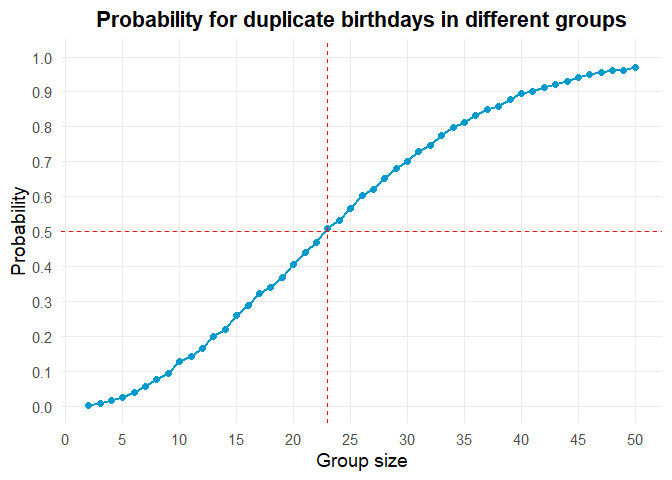
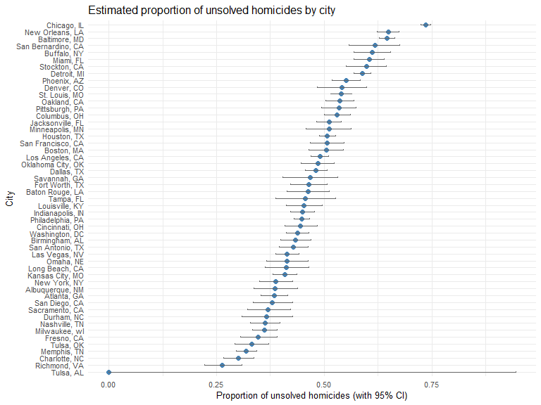

HW5
================
Rene Chi
2025-11-07

## Loading packages

``` r
library(tidyverse)
library(ggplot2)
library(broom)
```

## Problem 1

``` r
birthday_pool =
  function(n) {
  birthdays = sample(1:365, size = n, replace = TRUE)
  has_duplicate = length(birthdays) != length(unique(birthdays))
  return(has_duplicate)
}

# Simulation setting
set.seed(506)
n_simulations = 10000 
group_sizes = 2:50

probability_data =
  tibble(
  group_size = rep(group_sizes, each = n_simulations)
  ) |> 
  group_by(group_size) |> 
  mutate(
    match_result = map_lgl(group_size, birthday_pool)
  ) |> 
  summarise(
    probability = mean(match_result),
    .groups = 'drop'
  )

# Plot
probability_data |> 
  ggplot(aes(x = group_size, y = probability)) +
  geom_line(color = "deepskyblue3", linewidth = 1) +
  geom_point(color = "deepskyblue3", size = 2) +
  
  # mark the critical point when p exceeds 0.5
  geom_hline(yintercept = 0.5, linetype = "dashed", color = "red") +
  geom_vline(xintercept = 23, linetype = "dashed", color = "red") +
  
  # supplements
  labs(
    title = "Probability for duplicate birthdays in different groups",
    x = "Group size",
    y = "Probability"
  ) +
  scale_y_continuous(limits = c(0, 1), breaks = seq(0, 1, 0.1)) +
  scale_x_continuous(breaks = seq(0, 50, 5)) +
  theme_minimal(base_size = 14) +
  theme(
    plot.title = element_text(hjust = 0.5, face = "bold"),
    plot.subtitle = element_text(hjust = 0.5),
    panel.grid.minor = element_blank()
  )
```

<!-- -->

According to the plot, we can see that as group size increases, the
probability for duplicate birthdays increases as well. Moreover, when
group size is no smaller than 23, the probability will be greater than
0.5, which is surprising than initial intuition suggests. This
phenomenon is also called the birthday paradox.

## Problem 2

``` r
## Problem 2

mu_values = c(0, 1, 2, 3, 4, 5, 6)

simulation_results =
  tibble(
  true_mu = rep(mu_values, each = 5000),
  sim_id = 1:length(true_mu)
  ) |>
  mutate(
    test_output = map(true_mu, ~ {
      data_set = rnorm(n = 30, mean = .x, sd = 5)
      t.test(data_set, mu = 0) |> 
        tidy()
    })
  ) |>
  unnest(
    test_output
  ) |>
  select(
    true_mu,
    mu_hat = estimate,
    p_value = p.value
  ) |>
  mutate(
    reject_H0 = (p_value < 0.05)
  )

summary_stats =
  simulation_results |>
  group_by(true_mu) |>
  summarise(
    mean_mu_hat = mean(mu_hat),
    power_or_typeI_error = mean(reject_H0),
    .groups = 'drop'
  )
```

``` r
# plot power vs true mean
summary_stats |>
  ggplot(aes(x = true_mu, y = power_or_typeI_error)) +
  geom_line(color = "steelblue", linewidth = 1.2) +
  geom_point(color = "darkblue", size = 2) +
  labs(
    x = "True mean (μ)",
    y = "Power",
    title = "Power of the t-test vs. True Mean"
  ) +
  theme_minimal(base_size = 14)
```

<!-- -->

In this plot, when μ = 0, the rejection rate is about 0.05, which
matches the expected Type I error rate. As μ increases, the power rises
sharply — meaning the t-test becomes more powerful as the true mean
moves farther from 0. In other words, larger effect sizes lead to higher
power.

``` r
# plot 2
mean_estimates =
  simulation_results |>
  group_by(true_mu) |>
  summarise(
    mean_mu_hat_all = mean(mu_hat),
    mean_mu_hat_reject = mean(mu_hat[reject_H0]),
    .groups = "drop"
  )

mean_estimates |>
  ggplot(aes(x = true_mu)) +
  geom_line(aes(y = mean_mu_hat_all, color = "All samples"), linewidth = 1.2) +
  geom_point(aes(y = mean_mu_hat_all, color = "All samples"), size = 2) +
  geom_line(aes(y = mean_mu_hat_reject, color = "Rejected H0"), linewidth = 1.2, linetype = "dashed") +
  geom_point(aes(y = mean_mu_hat_reject, color = "Rejected H0"), size = 2) +
  labs(
    x = "True mean (μ)",
    y = "Average estimated μ head",
    title = "Average estimate μ head vs. True μ",
    color = "Group"
  ) +
  theme_minimal(base_size = 14)
```

<!-- -->

This plot shows two curves:

The solid line represents the average estimate of μ head across all
simulations, while the dashed line represents the average μ head only
among samples where the null was rejected.

The solid line lies close to the diagonal, showing that μ head is an
unbiased estimator of the true mean when considering all samples.
However, the dashed line (conditional on rejection) deviates from the
diagonal — it tends to overestimate μ when μ \> 0 and underestimate μ
when μ \< 0.

This happens because we’re conditioning on significant results. Only
extreme sample means lead to rejection of H0, so these samples are not
representative of all possible outcomes.

Therefore, The average μ head among rejected samples is not
approximately equal to the true μ. This bias arises from selection on
significance (aka the winner’s curse) where estimates from significant
tests tend to exaggerate the true effect size.

## Problem 3

``` r
homicide_df =
  read_csv("hw5 data/homicide-data.csv") |> 
  mutate(
    victim_age = na_if(victim_age, "Unknown"),  
    victim_age = as.numeric(victim_age)     
  )
```

    ## Rows: 52179 Columns: 12
    ## ── Column specification ────────────────────────────────────────────────────────
    ## Delimiter: ","
    ## chr (9): uid, victim_last, victim_first, victim_race, victim_age, victim_sex...
    ## dbl (3): reported_date, lat, lon
    ## 
    ## ℹ Use `spec()` to retrieve the full column specification for this data.
    ## ℹ Specify the column types or set `show_col_types = FALSE` to quiet this message.

The original data has 12 of homicide cases in 50 large U.S. cities, with
notable variables such as `victim_age`, `victim_sex` and `victim_race`.

``` r
homicide_df =
  homicide_df |> 
  mutate(
    city_state = str_c(city, state, sep = ", ")
  ) 

homicide_df |>
  group_by(city_state) |>
  summarise(
    total_homicides = n(),
    unsolved = sum(disposition %in% c("Closed without arrest", "Open/No arrest")),
    .groups = "drop"
  ) |> knitr::kable()
```

| city_state         | total_homicides | unsolved |
|:-------------------|----------------:|---------:|
| Albuquerque, NM    |             378 |      146 |
| Atlanta, GA        |             973 |      373 |
| Baltimore, MD      |            2827 |     1825 |
| Baton Rouge, LA    |             424 |      196 |
| Birmingham, AL     |             800 |      347 |
| Boston, MA         |             614 |      310 |
| Buffalo, NY        |             521 |      319 |
| Charlotte, NC      |             687 |      206 |
| Chicago, IL        |            5535 |     4073 |
| Cincinnati, OH     |             694 |      309 |
| Columbus, OH       |            1084 |      575 |
| Dallas, TX         |            1567 |      754 |
| Denver, CO         |             312 |      169 |
| Detroit, MI        |            2519 |     1482 |
| Durham, NC         |             276 |      101 |
| Fort Worth, TX     |             549 |      255 |
| Fresno, CA         |             487 |      169 |
| Houston, TX        |            2942 |     1493 |
| Indianapolis, IN   |            1322 |      594 |
| Jacksonville, FL   |            1168 |      597 |
| Kansas City, MO    |            1190 |      486 |
| Las Vegas, NV      |            1381 |      572 |
| Long Beach, CA     |             378 |      156 |
| Los Angeles, CA    |            2257 |     1106 |
| Louisville, KY     |             576 |      261 |
| Memphis, TN        |            1514 |      483 |
| Miami, FL          |             744 |      450 |
| Milwaukee, wI      |            1115 |      403 |
| Minneapolis, MN    |             366 |      187 |
| Nashville, TN      |             767 |      278 |
| New Orleans, LA    |            1434 |      930 |
| New York, NY       |             627 |      243 |
| Oakland, CA        |             947 |      508 |
| Oklahoma City, OK  |             672 |      326 |
| Omaha, NE          |             409 |      169 |
| Philadelphia, PA   |            3037 |     1360 |
| Phoenix, AZ        |             914 |      504 |
| Pittsburgh, PA     |             631 |      337 |
| Richmond, VA       |             429 |      113 |
| Sacramento, CA     |             376 |      139 |
| San Antonio, TX    |             833 |      357 |
| San Bernardino, CA |             275 |      170 |
| San Diego, CA      |             461 |      175 |
| San Francisco, CA  |             663 |      336 |
| Savannah, GA       |             246 |      115 |
| St. Louis, MO      |            1677 |      905 |
| Stockton, CA       |             444 |      266 |
| Tampa, FL          |             208 |       95 |
| Tulsa, AL          |               1 |        0 |
| Tulsa, OK          |             583 |      193 |
| Washington, DC     |            1345 |      589 |

``` r
baltimore_summary =
  homicide_df |> 
  filter(city_state == "Baltimore, MD") |> 
  summarise(
    unsolved = sum(disposition %in% c("Closed without arrest", "Open/No arrest")),
    total = n()
  )

# prop.test
baltimore_prop_test =
  prop.test(
    x = baltimore_summary$unsolved,
    n = baltimore_summary$total
)

baltimore_prop_test |>  
  broom::tidy() |>
  select(estimate, conf.low, conf.high) |> 
  knitr::kable()
```

|  estimate |  conf.low | conf.high |
|----------:|----------:|----------:|
| 0.6455607 | 0.6275625 | 0.6631599 |

``` r
# prop.test for all cities
city_results =
  homicide_df |>
  group_by(city_state) |>
  summarise(
    unsolved = sum(disposition %in% c("Closed without arrest", "Open/No arrest")),
    total = n(),
    .groups = "drop"
  ) |>
  mutate(
    test_result = map2(unsolved, total, \(x, n) prop.test(x = x, n = n)),
    tidy_result = map(test_result, tidy)
  ) |>
  unnest(tidy_result) |>
  select(city_state, estimate, conf.low, conf.high) 

knitr::kable(city_results)
```

| city_state         |  estimate |  conf.low | conf.high |
|:-------------------|----------:|----------:|----------:|
| Albuquerque, NM    | 0.3862434 | 0.3372604 | 0.4375766 |
| Atlanta, GA        | 0.3833505 | 0.3528119 | 0.4148219 |
| Baltimore, MD      | 0.6455607 | 0.6275625 | 0.6631599 |
| Baton Rouge, LA    | 0.4622642 | 0.4141987 | 0.5110240 |
| Birmingham, AL     | 0.4337500 | 0.3991889 | 0.4689557 |
| Boston, MA         | 0.5048860 | 0.4646219 | 0.5450881 |
| Buffalo, NY        | 0.6122841 | 0.5687990 | 0.6540879 |
| Charlotte, NC      | 0.2998544 | 0.2660820 | 0.3358999 |
| Chicago, IL        | 0.7358627 | 0.7239959 | 0.7473998 |
| Cincinnati, OH     | 0.4452450 | 0.4079606 | 0.4831439 |
| Columbus, OH       | 0.5304428 | 0.5002167 | 0.5604506 |
| Dallas, TX         | 0.4811742 | 0.4561942 | 0.5062475 |
| Denver, CO         | 0.5416667 | 0.4846098 | 0.5976807 |
| Detroit, MI        | 0.5883287 | 0.5687903 | 0.6075953 |
| Durham, NC         | 0.3659420 | 0.3095874 | 0.4260936 |
| Fort Worth, TX     | 0.4644809 | 0.4222542 | 0.5072119 |
| Fresno, CA         | 0.3470226 | 0.3051013 | 0.3913963 |
| Houston, TX        | 0.5074779 | 0.4892447 | 0.5256914 |
| Indianapolis, IN   | 0.4493192 | 0.4223156 | 0.4766207 |
| Jacksonville, FL   | 0.5111301 | 0.4820460 | 0.5401402 |
| Kansas City, MO    | 0.4084034 | 0.3803996 | 0.4370054 |
| Las Vegas, NV      | 0.4141926 | 0.3881284 | 0.4407395 |
| Long Beach, CA     | 0.4126984 | 0.3629026 | 0.4642973 |
| Los Angeles, CA    | 0.4900310 | 0.4692208 | 0.5108754 |
| Louisville, KY     | 0.4531250 | 0.4120609 | 0.4948235 |
| Memphis, TN        | 0.3190225 | 0.2957047 | 0.3432691 |
| Miami, FL          | 0.6048387 | 0.5685783 | 0.6400015 |
| Milwaukee, wI      | 0.3614350 | 0.3333172 | 0.3905194 |
| Minneapolis, MN    | 0.5109290 | 0.4585150 | 0.5631099 |
| Nashville, TN      | 0.3624511 | 0.3285592 | 0.3977401 |
| New Orleans, LA    | 0.6485356 | 0.6231048 | 0.6731615 |
| New York, NY       | 0.3875598 | 0.3494421 | 0.4270755 |
| Oakland, CA        | 0.5364308 | 0.5040588 | 0.5685037 |
| Oklahoma City, OK  | 0.4851190 | 0.4467861 | 0.5236245 |
| Omaha, NE          | 0.4132029 | 0.3653146 | 0.4627477 |
| Philadelphia, PA   | 0.4478103 | 0.4300380 | 0.4657157 |
| Phoenix, AZ        | 0.5514223 | 0.5184825 | 0.5839244 |
| Pittsburgh, PA     | 0.5340729 | 0.4942706 | 0.5734545 |
| Richmond, VA       | 0.2634033 | 0.2228571 | 0.3082658 |
| Sacramento, CA     | 0.3696809 | 0.3211559 | 0.4209131 |
| San Antonio, TX    | 0.4285714 | 0.3947772 | 0.4630331 |
| San Bernardino, CA | 0.6181818 | 0.5576628 | 0.6753422 |
| San Diego, CA      | 0.3796095 | 0.3354259 | 0.4258315 |
| San Francisco, CA  | 0.5067873 | 0.4680516 | 0.5454433 |
| Savannah, GA       | 0.4674797 | 0.4041252 | 0.5318665 |
| St. Louis, MO      | 0.5396541 | 0.5154369 | 0.5636879 |
| Stockton, CA       | 0.5990991 | 0.5517145 | 0.6447418 |
| Tampa, FL          | 0.4567308 | 0.3881009 | 0.5269851 |
| Tulsa, AL          | 0.0000000 | 0.0000000 | 0.9453792 |
| Tulsa, OK          | 0.3310463 | 0.2932349 | 0.3711192 |
| Washington, DC     | 0.4379182 | 0.4112495 | 0.4649455 |

``` r
# plot for estimates and CIs for each city
city_results |>
  mutate(city_state = fct_reorder(city_state, estimate)) |>  # 依未破案比例排序
  ggplot(aes(x = city_state, y = estimate)) +
  geom_point(size = 2, color = "steelblue") +
  geom_errorbar(aes(ymin = conf.low, ymax = conf.high), width = 0.2, color = "gray40") +
  coord_flip() +
  labs(
    x = "City",
    y = "Proportion of unsolved homicides (with 95% CI)",
    title = "Estimated proportion of unsolved homicides by city"
  ) +
  theme_minimal(base_size = 10)
```

<!-- -->
